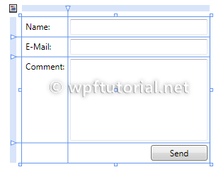

SpicyTaco.AutoGrid
==================

A magical replacement for the built in WPF Grid

Usage Examples
--------------

In order to get

<br/>
[Sourced from the awesome WpfTutorials](http://wpftutorial.net/GridLayout.html)

You would typically write XAML that looked like

``` XML
<Grid>
    <Grid.RowDefinitions>
        <RowDefinition Height="Auto" />
        <RowDefinition Height="Auto" />
        <RowDefinition Height="*" />
        <RowDefinition Height="28" />
    </Grid.RowDefinitions>
    <Grid.ColumnDefinitions>
        <ColumnDefinition Width="Auto" />
        <ColumnDefinition Width="200" />
    </Grid.ColumnDefinitions>
    <Label Grid.Row="0" Grid.Column="0" Content="Name:"/>
    <Label Grid.Row="1" Grid.Column="0" Content="E-Mail:"/>
    <Label Grid.Row="2" Grid.Column="0" Content="Comment:"/>
    <TextBox Grid.Column="1" Grid.Row="0" Margin="3" />
    <TextBox Grid.Column="1" Grid.Row="1" Margin="3" />
    <TextBox Grid.Column="1" Grid.Row="2" Margin="3" />
    <Button Grid.Column="1" Grid.Row="3" HorizontalAlignment="Right" 
            MinWidth="80" Margin="3" Content="Send"  />
</Grid>
```

You can simply write

``` XML
<st:AutoGrid Rows="Auto,Auto,*,28" Columns="Auto,200" Orientation="Vertical">
    <Label Content="Name:"/>
    <Label Content="E-Mail:"/>
    <Label Content="Comment:"/>
    <Label /> <!-- Empty placeholder for lower left corner -->
    
    <TextBox Margin="3" />
    <TextBox Margin="3" />
    <TextBox Margin="3" />
    <Button HorizontalAlignment="Right" 
            MinWidth="80" Margin="3" Content="Send"  />
</st:AutoGrid>
```

I personally like to put my `Label`s with the element they are labeling. So just remove the `Orientation` which defaults to `Horizontal` and rearrange the elements

``` XML
<st:AutoGrid Rows="Auto,Auto,*,28" Columns="Auto,200">
    <Label Content="Name:"/>
    <TextBox Margin="3" />
    
    <Label Content="E-Mail:"/>
    <TextBox Margin="3" />
    
    <Label Content="Comment:"/>
    <TextBox Margin="3" />
    
    <Label /> <!-- Empty placeholder for lower left corner -->
    <Button HorizontalAlignment="Right" 
            MinWidth="80" Margin="3" Content="Send"  />
</st:AutoGrid>
```

Credits
-------


Fire designed by Julien Deveaux from the Noun Project
